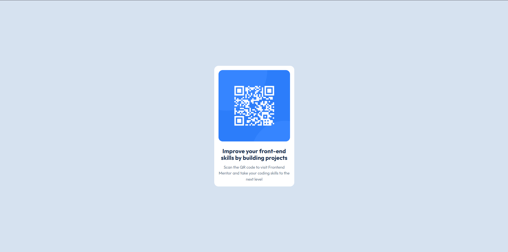

# Frontend Mentor - QR code component solution

This is a solution to the [QR code component challenge on Frontend Mentor](https://www.frontendmentor.io/challenges/qr-code-component-iux_sIO_H). Frontend Mentor challenges help you improve your coding skills by building realistic projects.

## Table of contents

- [Overview](#overview)
  - [Screenshot](#screenshot)
  - [Links](#links)
- [My process](#my-process)
  - [Built with](#built-with)
  - [Useful resources](#useful-resources)
- [Author](#author)

## Overview

### Screenshot



### Links

- Solution URL: [GitHub Repository](https://github.com/davidoadetayo/qr-code-component)
- Live Site URL: [GitHub Pages](https://davidoadetayo.github.io/qr-code-component/)

## My process

### Built with

- Semantic HTML5 markup
- CSS custom properties
- Flexbox for layout and centering
- CSS Grid for card arrangement
- Mobile-first workflow

### What I learned

- How to center a card both vertically and horizontally using Flexbox.
- Using CSS Grid to organize content inside the card.
- Styling a card component with shadows, border-radius, and spacing.
- Making the layout responsive using a mobile-first workflow.

```html
<div class="card">
  
  <h1>Improve your front-end skills by building projects</h1>
</div>
```

```css
.card {
  display: flex;
  flex-direction: column;
  gap: 20px;
  width: 300px;
  background-color: var(--White);
  padding: 16px;
  border-radius: 16px;
}
```

### Useful resources

- [CSS Tricks - Centering](https://css-tricks.com/centering-css-complete-guide/) - Helped me center elements perfectly using Flexbox.
- [Frontend Mentor Guide](https://www.frontendmentor.io) - Provides challenge details and submission tips.

## Author

- Frontend Mentor - [@davidoadetayo](https://www.frontendmentor.io/profile/davidoadetayo)
- GitHub - [David Adetayo](https://github.com/davidoadetayo)
